# Module 2 - Sierpinski Gasket and Shaders
This module exemined the use of base graphical components for a computing system by examining a Sierpinski Gasket that was rendered with vertex and fragment shaders.

## Work Progression
- **Commit b0fdbab95e7677635f4a76ae9c1e898a83e12443** - Intiial commit wtih the template set up that ws described in [Mozilla Developer Reference from Course Material Recommendations](https://developer.mozilla.org/en-US/docs/Web/API/WebGL_API/Tutorial) that appears to not be working correctly.
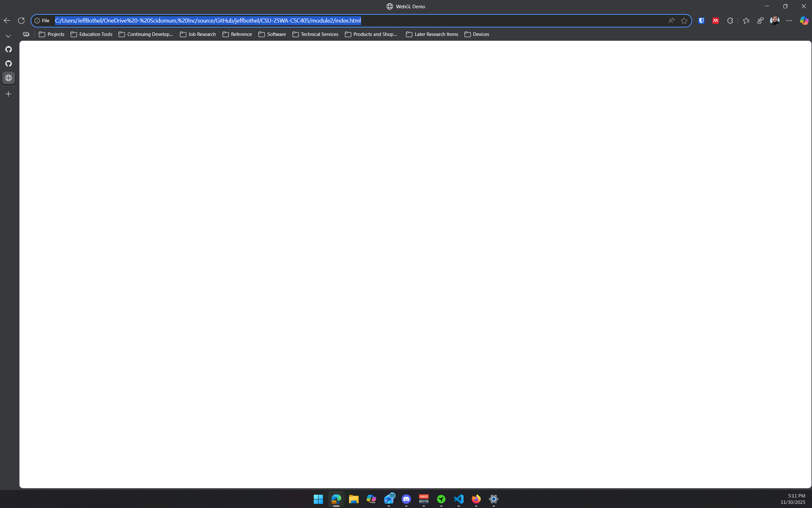
- **Commit 59c7b9f04bce4290f5adcb1840c9ea3e9a40111e** - Addition of illustrations that showcase where the frame is supposed to be on the page.
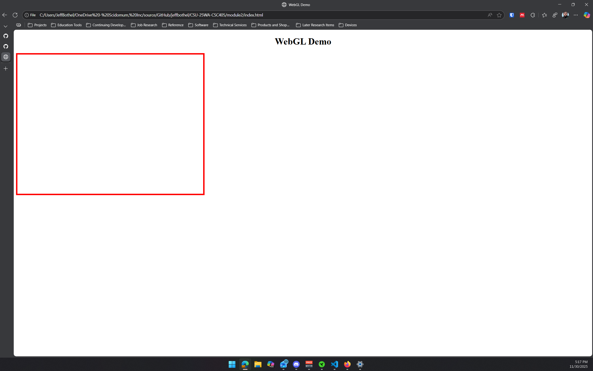
- **Commit f6ba5a026053f88e677fd4b88befc80ffe405d5e** - Utilized Copilot to help with issues that lead too a CORS permissions issues for scripting with the WebGL script.
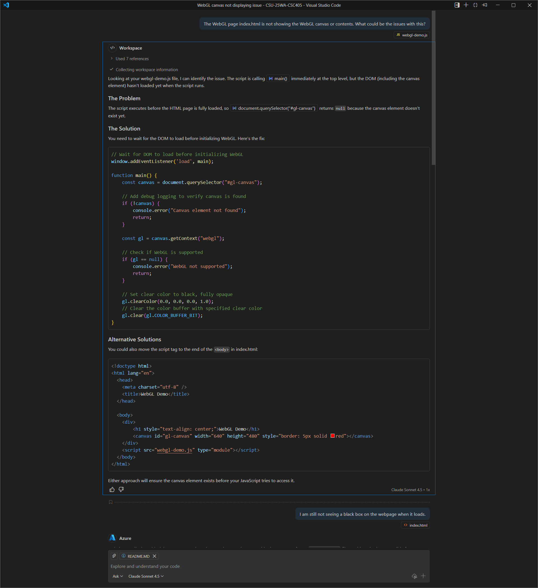
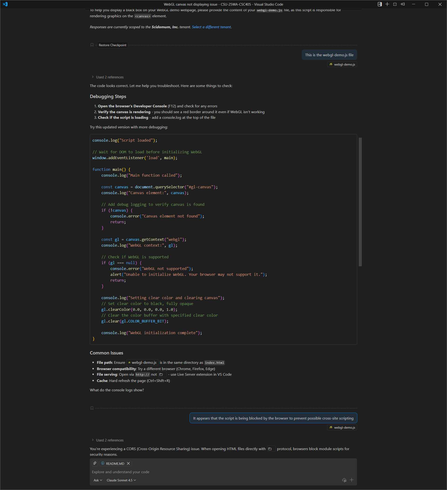
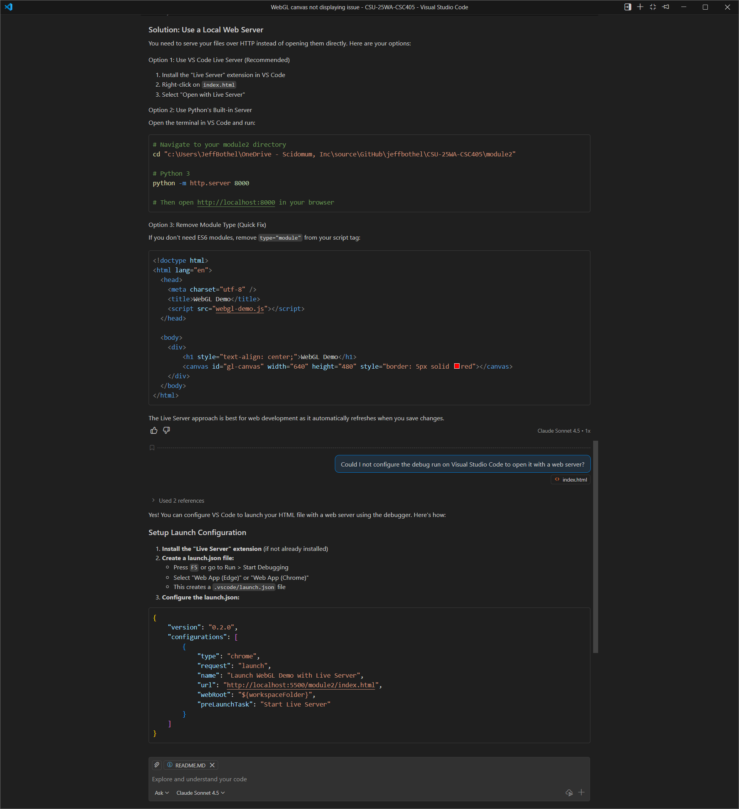
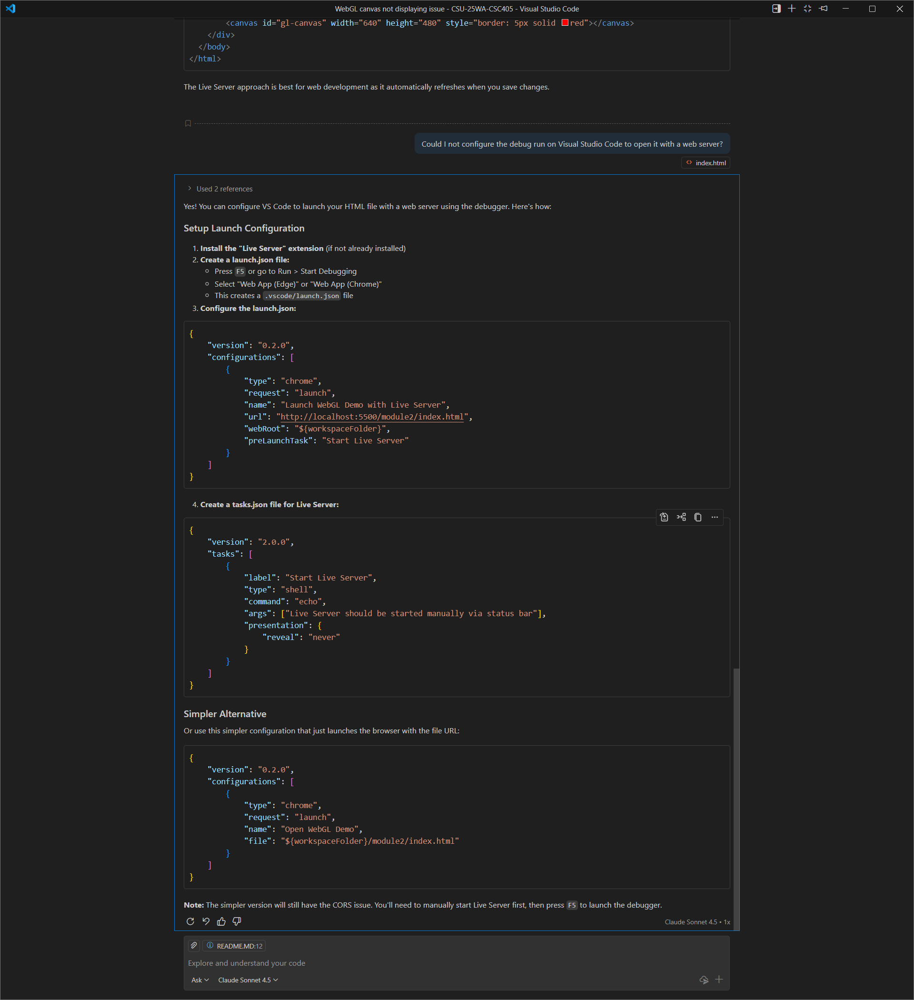
- **Commit eacecb7db9decff20bcdf5c6ed776675f2451aee** - Figured out a workaround that creates a local server instance that will run and provide the page from the [Live Server extension in VS Code](https://marketplace.visualstudio.com/items?itemName=ritwickdey.LiveServer). Made a change to the [webgl-demo.js](webgl-demo.js) file that does show changes to the color of the box on rendered on the screen to confirm.
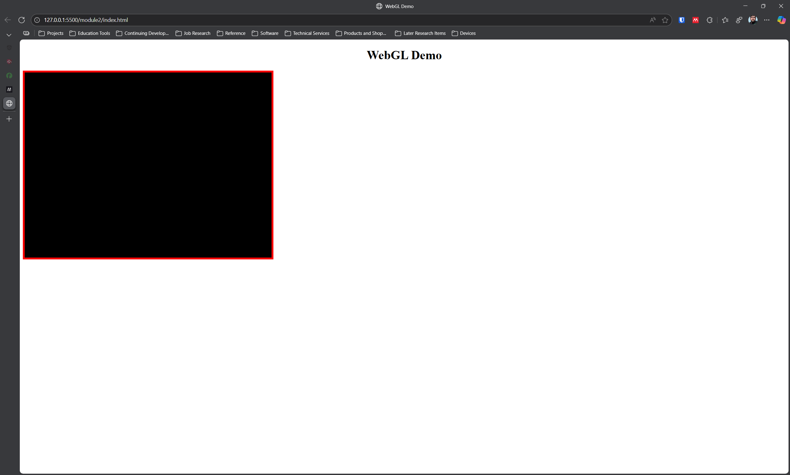

- **Commit 04bdceb1150e153bf1be22da81059faa3222be9b** - I was getting errors for various functions missing. I worked on pulling together the common resources from the provided example files `Common` folder that is now in the repo root as a new `Common` folder. This was to match the scripts that appear to be present in [gasket1.html](https://www.interactivecomputergraphics.com/Code/02/gasket1.html) from the example.
https://www.interactivecomputergraphics.com/Code/Common/
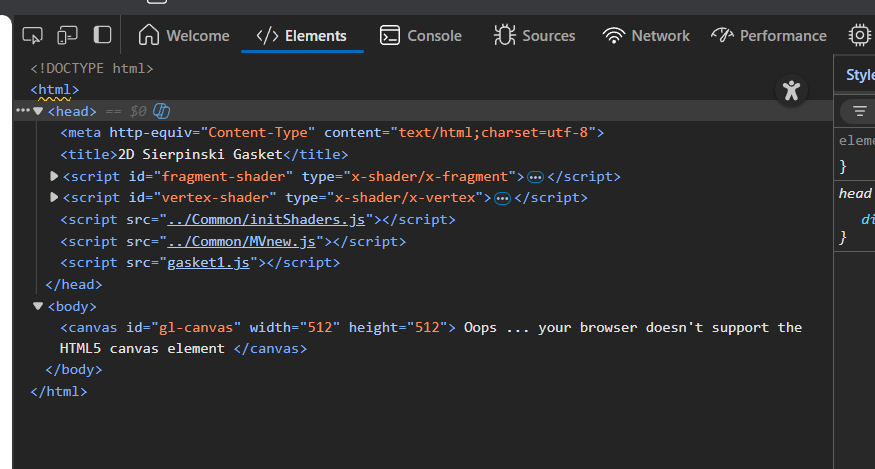
- **Commit 05f3968a2f72da2eaa6b6ea4a74ab773cf62f22b** - Created various code elements to load the Sierpinski Gasket based on the code provided in the book materials. Comments added from where the code elements were provided from that source. Now I am getting an error related to the vertex shader being an incompatible version.
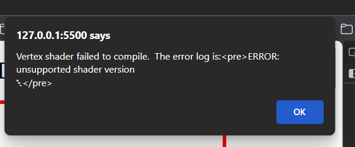
- **Commit c0d4cd1621d35d4905dad5794365b72b630ee77e** - Utilized GitHub Copilot to analyze the code I assembled and determined that I was making incorrect version references in the functions for getting canvas information. I needed to correct that to WebGL2 referencing instead. 
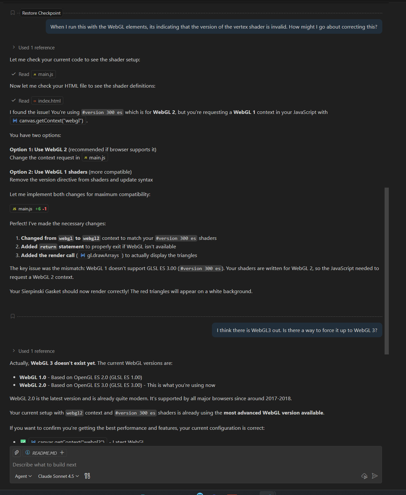
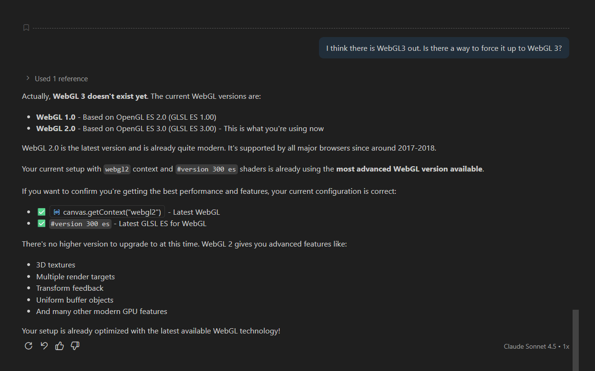
- **Commit 1** - Made minor changes towards readying the program for report writing from the critical thinking exercise. Additionally made a couple cosmetic and logging adjustments for greater verbose logging and better display of the WebGL components.

## References Utilized
- [Mozilla Developer Reference from Course Material Recommendations](https://developer.mozilla.org/en-US/docs/Web/API/WebGL_API/Tutorial) - Utilized to create the initial set up of the WebGL environment for programming.
- [Textbook Code Examples](https://www.interactivecomputergraphics.com/Code/02/gasket1.js) - Code examples that are provided with the course textbook.